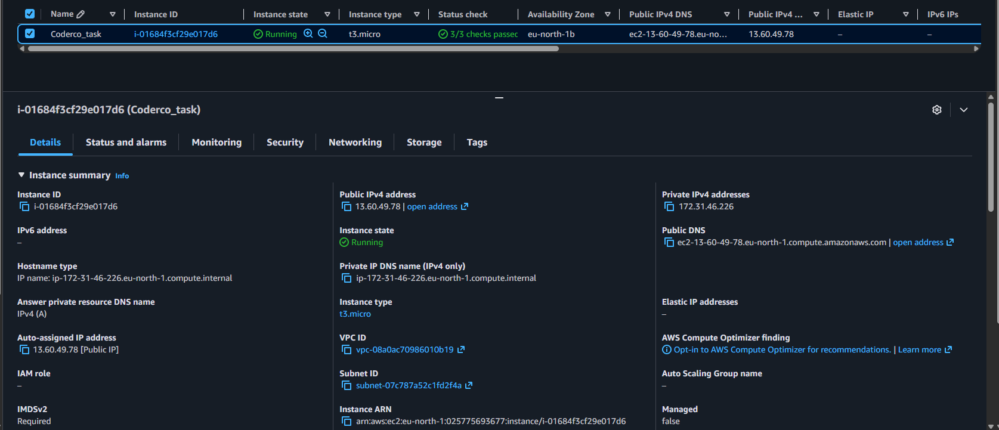
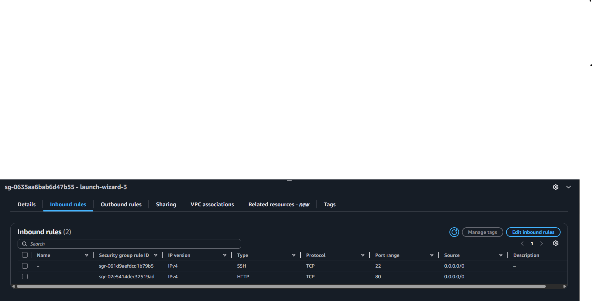
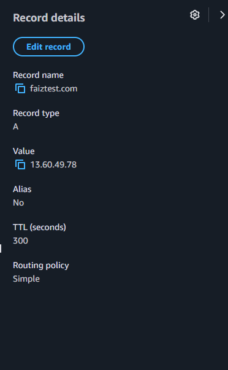
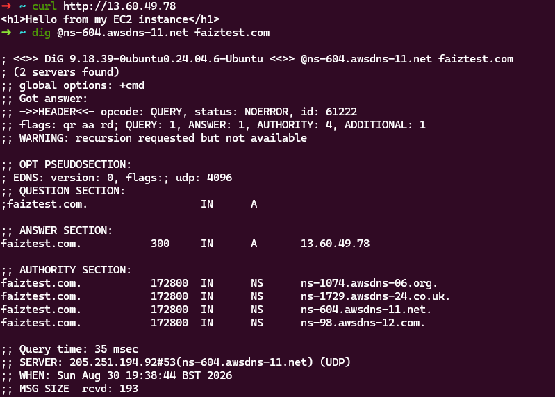

# AWS DNS + EC2 + HTTP Lab

A simple hands-on project demonstrating how DNS, EC2, and HTTP work together
in a real cloud environment.

## What this project does
- Launches an EC2 instance (Amazon Linux 2023)
- Configures a security group to allow HTTP traffic, so the instance is
  publicly reachable over port 80
- Automatically installs and configures Apache (httpd) via EC2 User Data
- Creates a Route 53 hosted zone and A record pointing a domain to the instance
- Confirms end-to-end resolution: domain → DNS → IP → HTTP response

## Architecture
Domain name → Route 53 (authoritative DNS) → EC2 public IP → Apache (port 80)

## Files
- `setup.sh` — User Data script that configures the EC2 instance on first boot

## What I learned
- How to launch an EC2 instance with the correct security group rules to
  allow HTTP traffic in (port 80, source 0.0.0.0/0), as opposed to SSH
  (port 22, restricted to a single IP) — each service gets only the access
  it actually needs
- How A records map a domain to an IP address
- The role of an authoritative DNS server (confirmed via the `aa` flag in dig output)
- Why HTTP and SSH require different security group rules (public vs restricted access)
- TTL and its effect on DNS caching/propagation

## Evidence

### EC2 instance running

### Security group — HTTP and SSH rules

### Route 53 A record

### DNS resolution and HTTP response confirmed via terminal

